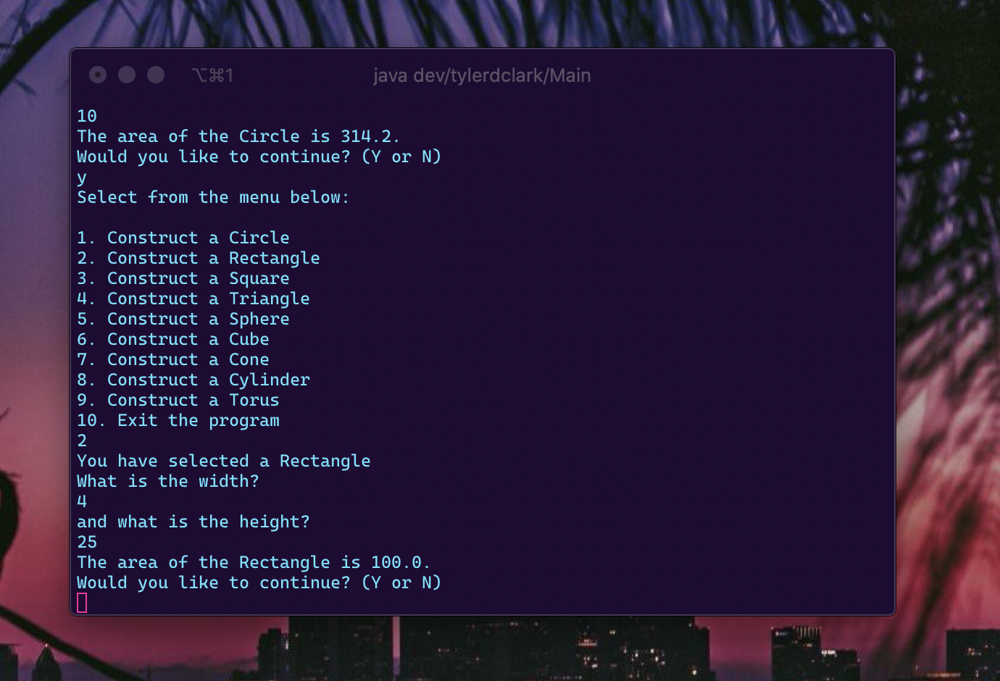
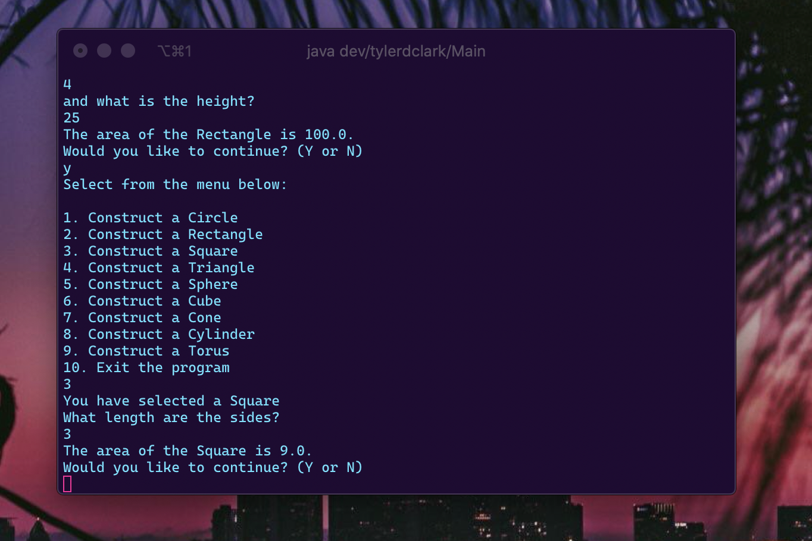
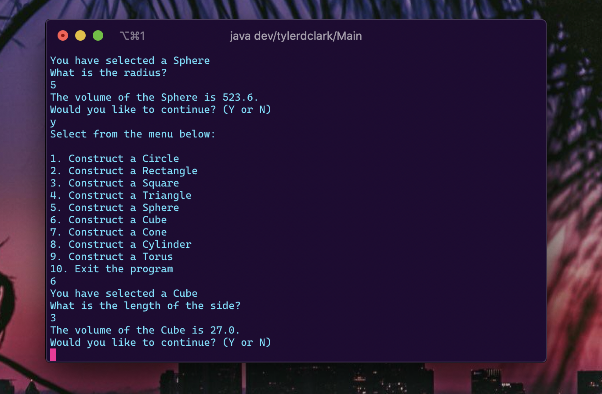
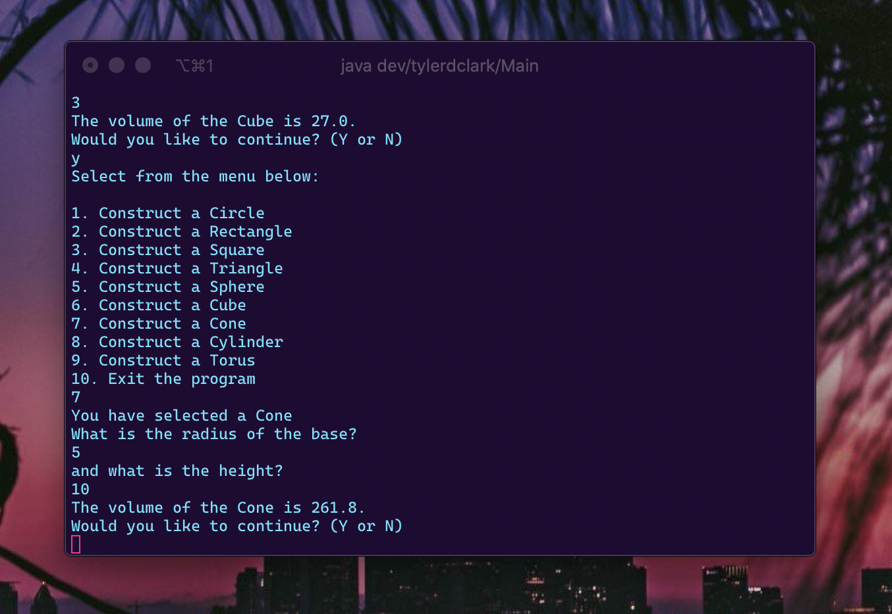
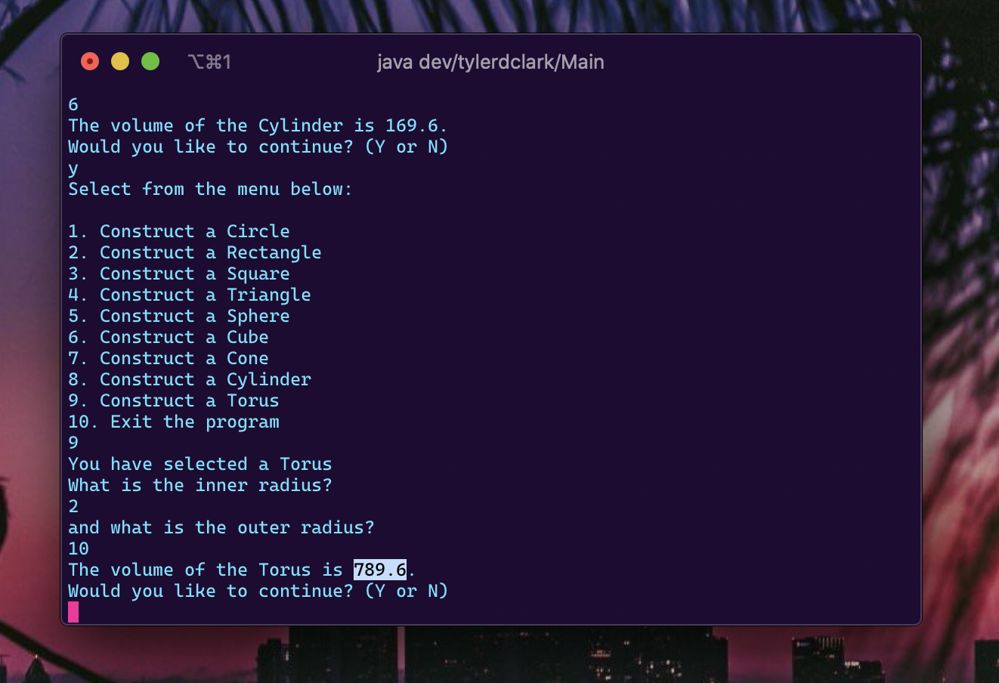
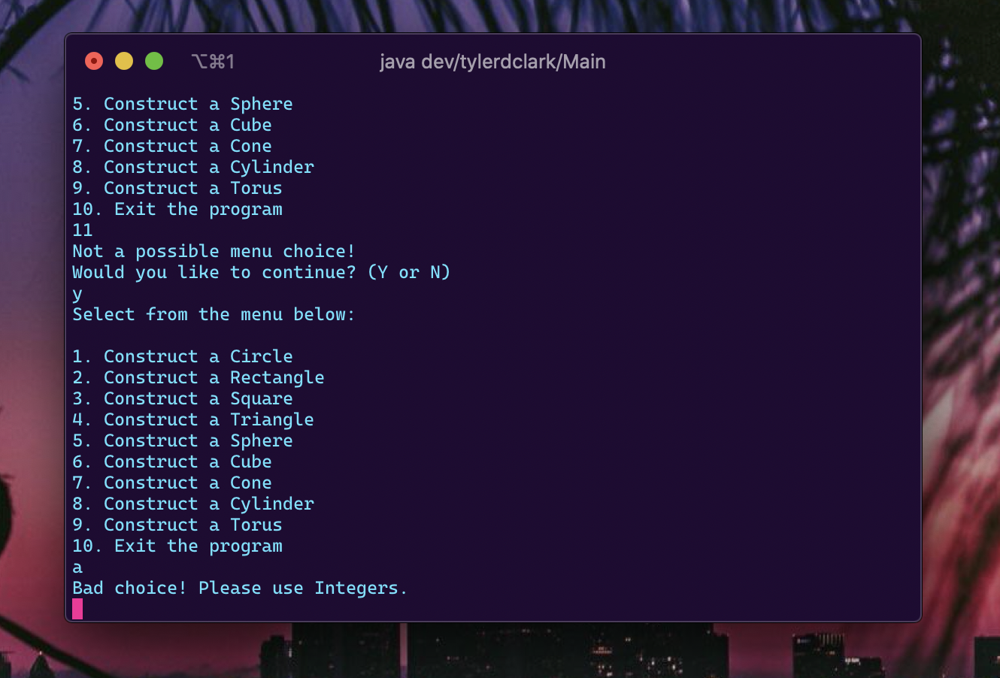
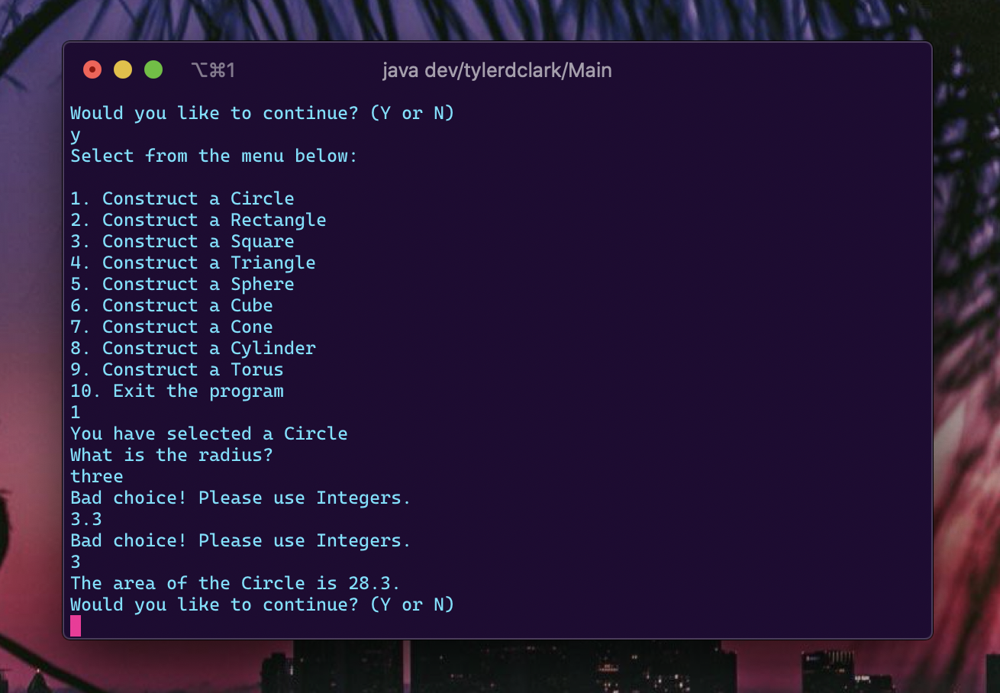
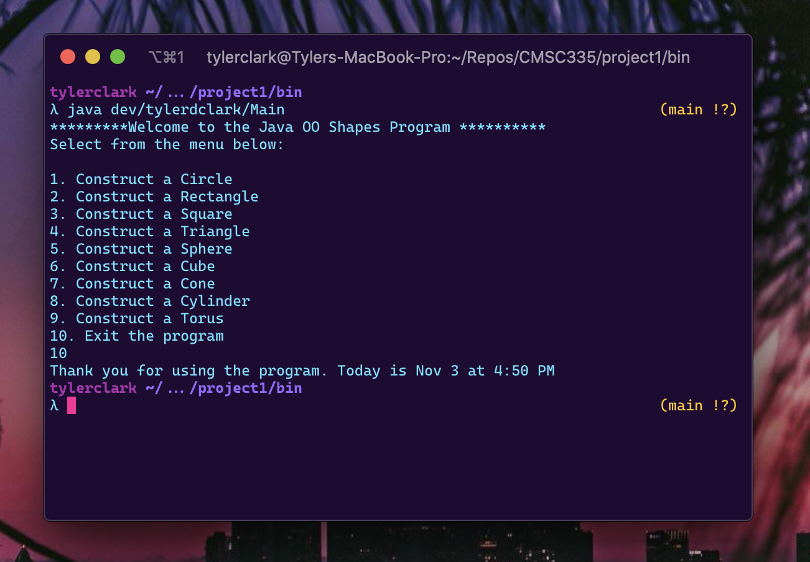

# CMSC 330 - Project 1 - OO Shape Program

**Author:** Tyler D Clark  
**Date:** 1 November 2020

**Description** A command-driven program that allows the creation of 2 dimensional and 3 dimensional shapes. After the creation of the shapes based of integers collected from the user, the program then displays the area for the 2d shapes and volume for the 3d shapes. The program menu will continually prompt for new shapes until users chooses to exit. Prompts for integer inputs will persistently warn against incorrect input.
___

## File Layout

``` bash
|____sources.txt
|
|____doc
| |____project1.md
|
|____src
| |____dev
| | |____tylerdclark
| | | |____two_dimensional
| | | | |____TwoDimensionalShape.java
| | | | |____Triangle.java
| | | | |____Circle.java
| | | | |____Rectangle.java
| | | | |____Square.java
| | | |____Menu.java
| | | |____Main.java
| | | |____three_dimensional
| | | | |____Cone.java
| | | | |____Torus.java
| | | | |____Sphere.java
| | | | |____Cylinder.java
| | | | |____ThreeDimensionalShape.java
| | | | |____Cube.java
| | | |____Shape.java
```

## UML Diagram


## Running the Program

First step is to compile the source code. Included is a sources.txt to compile from. Ensure you are within the project1 directory and run the following command:

```bash
javac -d bin @sources.txt
```

This command will compile the Java source code into .class files in a newly created bin directory. Next, cd into that bin directory:

```bash
cd bin
```

and run the Main class with java, using the fully qualified class name:

```bash
java dev/tylerdclark/Main
```

Screenshot of successful compilation:


## Testing the Program

The following sections will test the program's functionality

### Basic 2d shapes

To test the basic 2d shapes, menu options 1 through 4 will be selected. For testing of object creation, simple integers will be passed. The area output will be compared against the actual area.

|  Shape | Input  | Expected Output  | Actual Output  |
|---|---|---|---|
| Circle | 10 | A=πr2=π·10·2≈314.15927 | 314.2 |

Screenshot:


|  Shape | Input  | Expected Output  | Actual Output  |
|---|---|---|---|
| Rectangle | 4, 25 | A=wl=4·25=100 | 100.0 |

Screenshot:



|  Shape | Input  | Expected Output  | Actual Output  |
|---|---|---|---|
| Square | 3 | A=s^2=3^2=9 | 9.0 |

Screenshot:



|  Shape | Input  | Expected Output  | Actual Output  |
|---|---|---|---|
| Triangle | 3, 4 | A=h·b/2=3·4/2=6 | 6.0 |

Screenshot:


### Basic 3d shapes

Options 5 through 9 will be used for 3d shapes. Similar to before, ints will be passed as it is the design of the program. Output of the volume will be compared against the actual volume.

|  Shape | Input  | Expected Output  | Actual Output  |
|---|---|---|---|
| Sphere | 5 | V=4/3·π·r^3=4/3·π·5^3≈523.59878 | 523.6 |

Screenshot:


|  Shape | Input  | Expected Output  | Actual Output  |
|---|---|---|---|
| Cube | 3 | V=a^3=3^3=27 | 27.0 |

Screenshot:



|  Shape | Input  | Expected Output  | Actual Output  |
|---|---|---|---|
| Cone | 5, 10 | V=π·r^2·h/3=π·5^2·10/3≈261.79939 | 261.8 |

Screenshot:



|  Shape | Input  | Expected Output  | Actual Output  |
|---|---|---|---|
| Cylinder | 3, 6 | V=π·r^2·h=π·3^2·6≈169.646 | 169.6 |

Screenshot:


|  Shape | Input  | Expected Output  | Actual Output  |
|---|---|---|---|
| Torus | 2, 10 | V=(π·r^2)·(2·π·R)=(π·2^2)·(2·π·10)≈789.56835 | 789.6 |

Screenshot:



### Other tests

This section tests the other aspects of the program, incorrect input handling, and exit program.

|  Test Description | Input  | Expected Output  | Actual Output  |
|---|---|---|---|
| Incorrect menu option | 11 | error handling | "Not a possible menu choice!" |
| Incorrect menu option | a | error handling | "Bad choice! Please use Integers." |

Screenshot:



|  Test Description | Input  | Expected Output  | Actual Output  |
|---|---|---|---|
| Non-integer input in shape creation | three | error handling | "Bad choice! Please use Integers." |
| Non-integer input in shape creation | 3.3 | error handling | "Bad choice! Please use Integers." |

Screenshot:



|  Test Description | Input  | Expected Output  | Actual Output  |
|---|---|---|---|
| Uppercase Y to continuation prompt | Y | Program continues | Program continues |

(lowercase has been used in previous examples)

Screenshot:


|  Test Description | Input  | Expected Output  | Actual Output  |
|---|---|---|---|
| Option 10 from menu| 10 | Thanks user, displays date and time info and program exits | "Thank you for using the program. Today is Nov 3 at 4:50 PM" |

Screenshot:



|  Test Description | Input  | Expected Output  | Actual Output  |
|---|---|---|---|
| 'n' to continuation prompt | n | Thanks user, displays date and time info and program exits | "Thank you for using the program. Today is Nov 3 at 4:50 PM" |

Screenshot:


## Lessons learned / Conclusion

Through this program, I got good practice with Object Oriented programming and Java. The differences between 2d and 3d shapes and the similarities of their children gave a good use for inheritance. How each shape differently implemented either area() or volume() stood out as a good use-case for an abstract class. Each shape would have to implement those methods since none were the same. I tried to further use inheritance by overriding toString() in TwoDimensionalShape and ThreeDimensionalShape. I could have allowed floats or doubles to be passed to constructors for either shape types, but I did not want to over-complicate. Overall the program was fun to write and document!