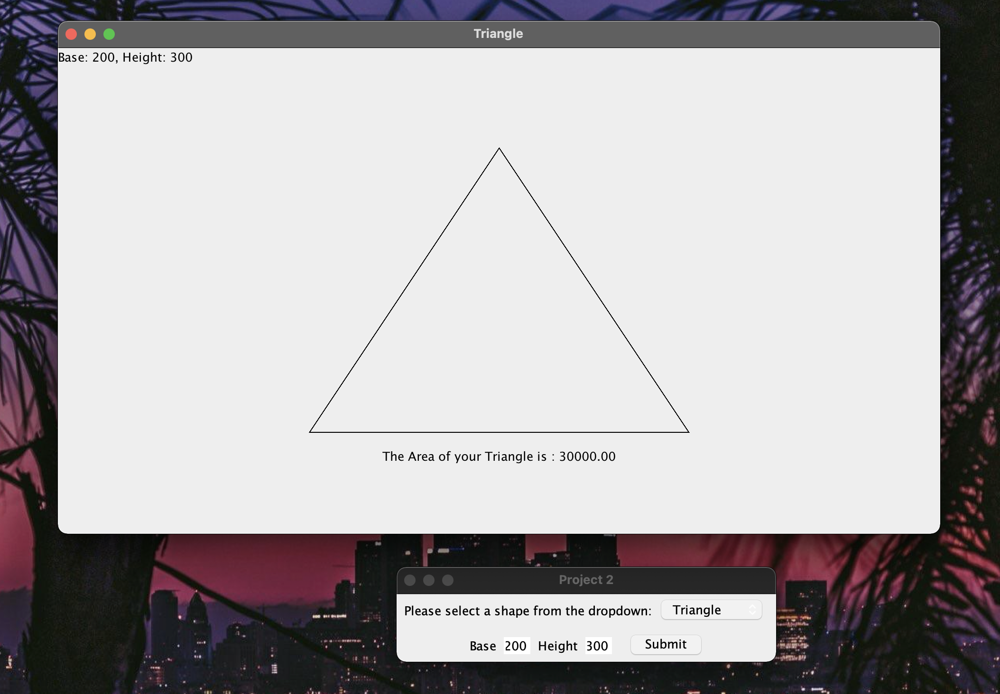

# CMSC 330 - Project 2 - OO Shape Program revisited

**Author:** Tyler D Clark  
**Date:** 17 November 2020

**Description** A GUI program that creates shapes based on dimensions given from the user. The program then displays an image of the shape. 2D shape will be have sizes corresponding to the dimensions given. 3D shapes will simply display a image of the shape. 

___

## File Layout

``` bash
|----out
||____project2.jar
|____doc
| |____project2.md
| |____project2.pdf
|____src
| |____img
| | |____cube.jpg
| | |____sphere.jpg
| | |____torus.jpg
| | |____cone.jpg
| | |____cylinder.jpg
| |____dev
| | |____tylerdclark
| | | |____two_dimensional
| | | | |____TwoDimensionalShape.java
| | | | |____Triangle.java
| | | | |____Circle.java
| | | | |____Rectangle.java
| | | | |____Square.java
| | | |____Main.java
| | | |____gui
| | | | |____SpecificationPanel.java
| | | | |____DrawFrame.java
| | | | |____MenuGUI.java
| | | |____three_dimensional
| | | | |____Cone.java
| | | | |____Torus.java
| | | | |____Sphere.java
| | | | |____Cylinder.java
| | | | |____ThreeDimensionalShape.java
| | | | |____Cube.java
| | | |____Shape.java
```

## UML Diagram


## Running this program

This program was compiled into a jar file for ease of use. The only requirement for this program is an up-to-date Java runtime to be installed on the machine. To run this program, simply enter the command while in the out directory:

``` bash
java -jar project2.jar
```

 Screenshot:


## Testing the Program

The following sections will test the program's functionality

### basic 2D shapes

The 2D shapes are the first 4 options of the dropdown box. They will only be passed integers for these first couple test cases

|  Shape | Input  | Expected Output  | Actual Output  |
|---|---|---|---|---|
| Circle | 100 | A=π·r·2=π·100·2≈31415.93| 31415.93 |

Screenshot:


|  Shape | Input  | Expected Output  | Actual Output  |
|---|---|---|---|---|
| Rectangle | 200, 100 | A=w·l=200·100=20000 | 20000.00 |

Screenshot:


|  Shape | Input  | Expected Output  | Actual Output  |
|---|---|---|---|---|
| Square | 150 | A=s^2=150^2=22500 | 22500.00 |

Screenshot:


|  Shape | Input  | Expected Output  | Actual Output  |
|---|---|---|---|---|
| Triangle | 100, 150 | A=h·b/2=150·100/2=7500 | 7500.00 |

Screenshot:


### Basic 3d shapes

The rest of the dropdown list is dedicated to the 3d shapes. Similar to before, ints will be passed as it is the design of the program. Output of the volume will be compared against the actual volume.

|  Shape | Input  | Expected Output  | Actual Output  |
|---|---|---|---|---|
| Cone | 50, 100 | V=π·r^2·h/3=π·50^2·100/3≈261799.39 | 261799.39 |

Screenshot:


|  Shape | Input  | Expected Output  | Actual Output  |
|---|---|---|---|---|
| Cube | 50 | V=a^3=50^3=125000 | 125000.00 |

Screenshot:


|  Shape | Input  | Expected Output  | Actual Output  |
|---|---|---|---|---|
| Cylinder | 25, 75 | V=π·r^2·h=π·25^2·75≈147262.16 | 147262.16 |

Screenshot:


|  Shape | Input  | Expected Output  | Actual Output  |
|---|---|---|---|---|
| Sphere | 35 | V=4/3·π·r^3=4/3·π·35^3≈179594.38 | 179594.38 |

Screenshot:


|  Shape | Input  | Expected Output  | Actual Output  |
|---|---|---|---|---|
| Torus | 10, 100 | V=(π·r^2)·(2·π·R)=(π·2^2)·(2·π·10)≈197392.09 | 197392.09 |

Screenshot:


### Other tests

Since there is only a limited way to interact with this program, the last section shows how it handles incorrect input. 

Non-numbers:


Decimals:


Zeros:


Negatives:


## Lessons learned / Conclusion

The program gave me a several challenges to overcome that brought me to a better understanding of Object Oriented principles and programming in general.

First, I was familiar with the paintComponent() method, so I knew I would be able to either make the shape objects extend JPanel or have a method return a new JPanel. I decided on the latter because I could have Shape class declare it abstract and leave it to the children class to implement. All of the 3D shapes were similar because I simply had to display the images.

My first major snag was in the 2D shapes when I got to Triangle. I did not realize that Graphics did not have a drawTriangle() method, but thankfully there is the drawPolygon() method. I learned it and how it is passed arrays of x coordinates and y coordinates and carried along.

I was sort of stumped when it came to building the GUI. I didn't know how I was to show the variable-count requirements for the shapes in a single panel, so I decided to show JLabels and JTextFields dynamically. I used an ActionListener on the JComboBox to create the JLabels and JTextFields depending on the shape chosen.

Lastly, some of the harder problems were self-inflected. I really wanted the shapes to show up centered on the new JPanels the were drawn to. The drawImage() and the draw shape methods all draw from the upper left hand corner, so there was some math to do. The triangle was the worst. But, if the window is resized, all of the shapes stay centered and i'm happy. I also had some issues with the file pathing of the 3d shape images when I compiled it into a jar file, but I got that fixed.

Overall I enjoyed coding this project and learned a lot!

### Centered!

