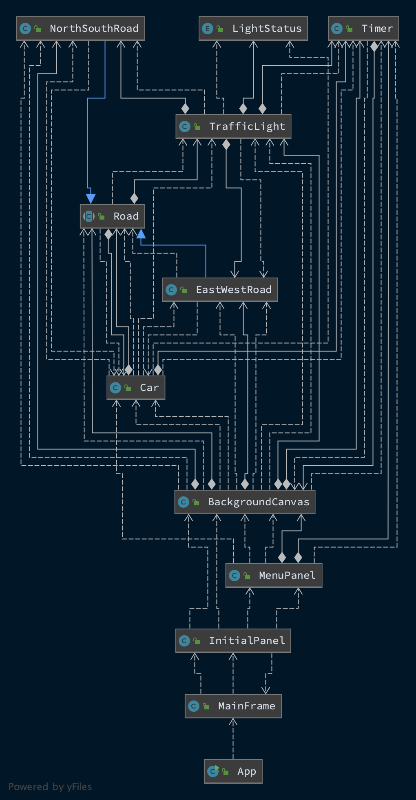
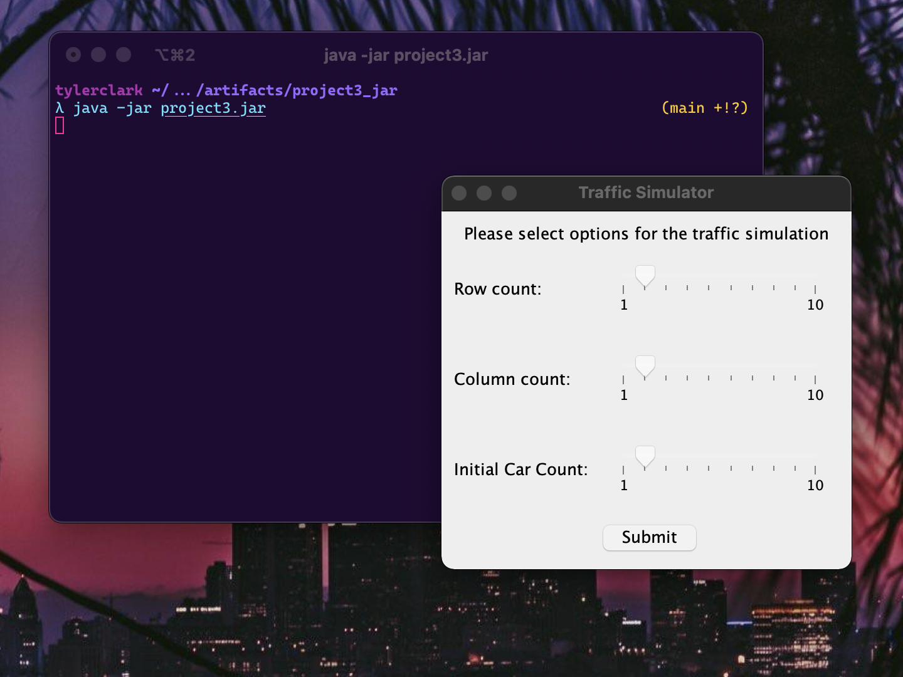
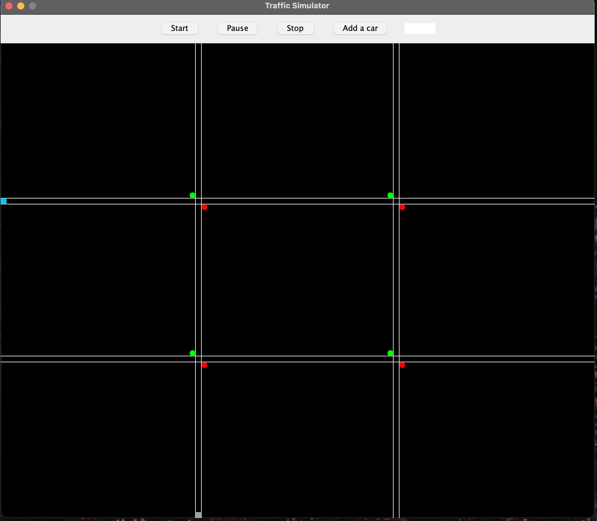
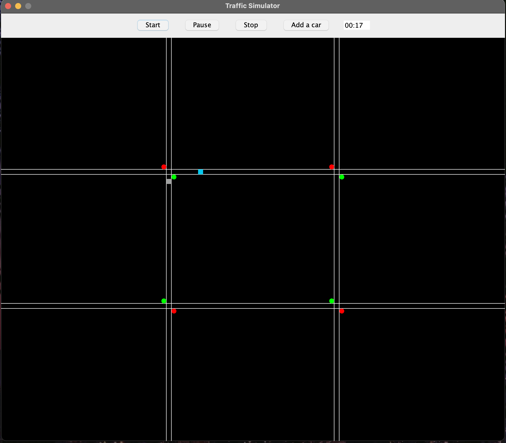
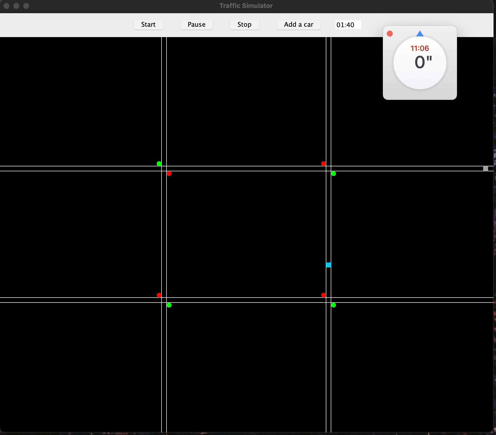
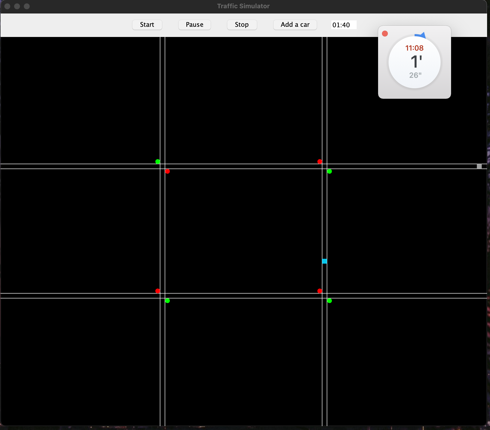
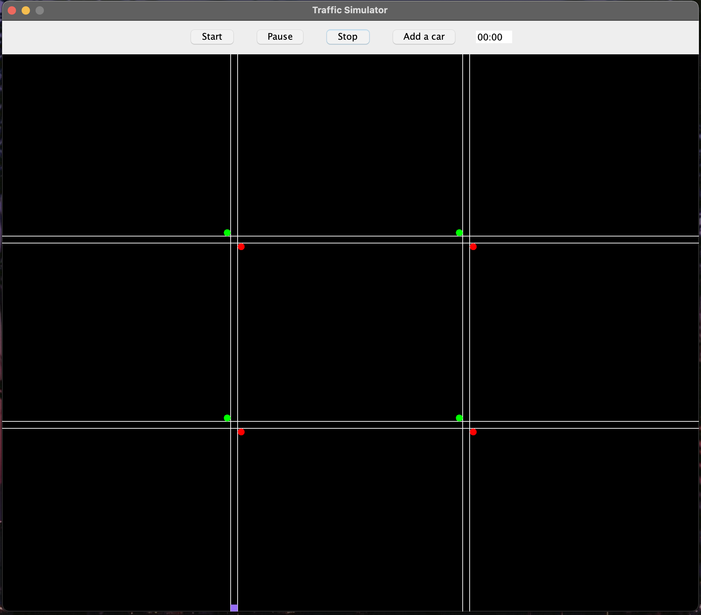
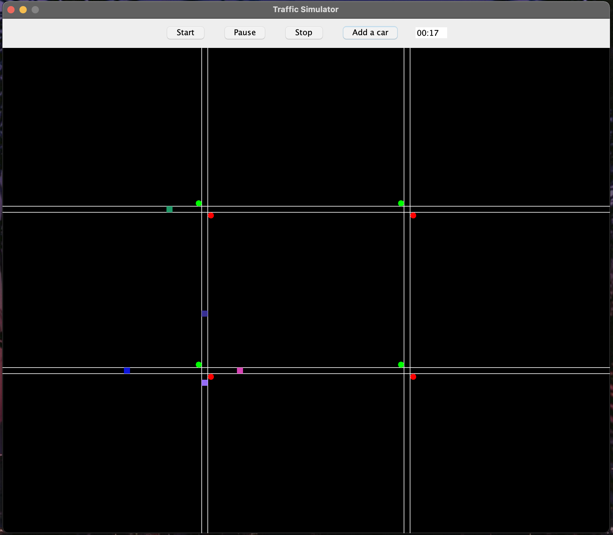
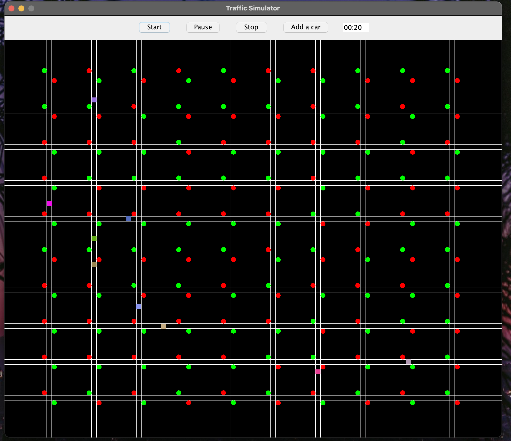

# CMSC 335 - Project 3 - Traffic simulation

**Author:** Tyler D Clark  
**Date:** 14 December 2020

**Description** A program that simulates traffic using swing GUI, event handlers, listeners and incorporates Java’s concurrency functionality and the use of threads. The program first prompts for the number of column and row roads and initial cars. It then creates a canvas and allows the the traffic simulation to be started, paused, stopped and additional cars to be added.

___

## File Layout

``` bash
|____doc
| |____project3.md
|-----out
| |_____project3.jar
|____src
| |____META-INF
| | |____MANIFEST.MF
| |____dev
| | |____tylerdclark
| | | |____traffic
| | | | |____Road.java
| | | | |____NorthSouthRoad.java
| | | | |____TrafficLight.java
| | | | |____EastWestRoad.java
| | | | |____Car.java
| | | |____util
| | | | |____Timer.java
| | | | |____LightStatus.java
| | | |____gui
| | | | |____BackgroundCanvas.java
| | | | |____MenuPanel.java
| | | | |____MainFrame.java
| | | | |____App.java
| | | | |____InitialPanel.java
```

## UML Diagram

It's very busy looking! 



## Running this program

This program was compiled into a jar file for ease of use. The only requirement for this program is an up-to-date Java runtime to be installed on the machine. To run this program, simply enter the command while in the out directory:

``` bash
java -jar project3.jar
```

 Screenshot:


## Testing the Program

The following sections will test the program's functionality to start various simulations, pause and stop them.

### Test case 1

The first test case will simply test the programs ability to start a traffic simulation with 2 row roads and 2 column roads and 2 cars. These are the default options of the initial panel.

Screenshot:


### Test case 2

This test will test the ability of the program to start. After pressing "Start, the timer will begin counting and every second the cars will move (unless they are at a red light). The cars will move a random amount that is set in their constructor.

Screenshot:


### Test case 3

The pause is a boolean inside the timer object that is passed to all Threads. This test case shows that when the "pause" is set to true by the JButton, all worker pause.

Screenshot of starting pause:


Screenshot of a bit after pause is pressed:


### Test case 4

The Stop button replaces the JPanel that is being drawn to with a new one with matching starting conditions of the previous one. The cars are still randomly placed. This test case will test that Stop does create a new canvas and it will also test add new random cars using the "Add a car" JButton.

After pressing "Stop", new canvas:


Adding a few cars:


### Test case 5

This test case will test the max options in the initial panel. This simulation is to have 10 rows, 10 columns and 10 initial cars

A busy-looking simulation with 111 SwingWorkers:


## Discussion / Lessons learned / Conclusion

This was a big learning experience for me. I could write a full essay on the roadblocks I encountered and the lessons learned.

First, I had to make a decision on the design of the program. I knew right away I wanted to have multiple roads with multiple intersections. I elected to collect the number of rows and columns in an initial prompt. I capped roads at 10 rows and columns because anymore would just be ridiculous. I used some math to draw them at regular intervals. When designing the roads, I first was going to try with 2 way roads but later scrapped it when I found out how difficult it would be later. With 3 turn decisions vs 2 with one way roads and not to mention the problem to car collisions at intersections. 2 way roads would be doable with a little more time although. I decided to make the roads loop because I thought an endless road would be fun.

Overall, the whole design was difficult for me, but the way I "got it to work" was to pass around a SwingWorker Timer object. The other objects (Traffic lights, cars) would operate as long as the timer was not paused or stopped. Stopping a timer would prompt it to be replaced with another. I soon ran into a particular problem when increasing the number of SwingWorkers I was using. I found that some Threads would simply not execute. After much head scratching, I discovered that there is a cap of 10 SwingWorkers for a java program. However, I found a way to circumvent this by using a ExecutorService (Like from the discussion post!). I just calculated how many threads I might need (columns * rows) + initial car count + 1 for timer + 10 extra for cars to add and then created a fixed size pool.

There are some clear limitations of my program. First, The timer is only a pseudo-timer and simply Thread.sleep()'s 1000 ms before increasing a second counter. I did it this way so that I could easily pause and play in a loop while keeping the count. Another limitation is the car interactions. I had a difficult time ensuring they didn't drive on top of each other. If two cars stop at the same light, they can overlap until they make different turns. When driving, they will slow for slower cars in front although.

Overall I had a really fun time with this program and it really tested my abilities with concurrent programming. I would definitely clean up the code some more with more time, but it runs!
